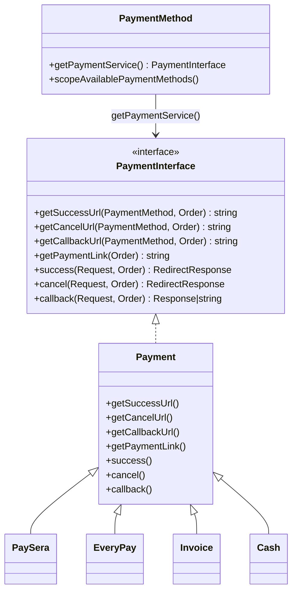
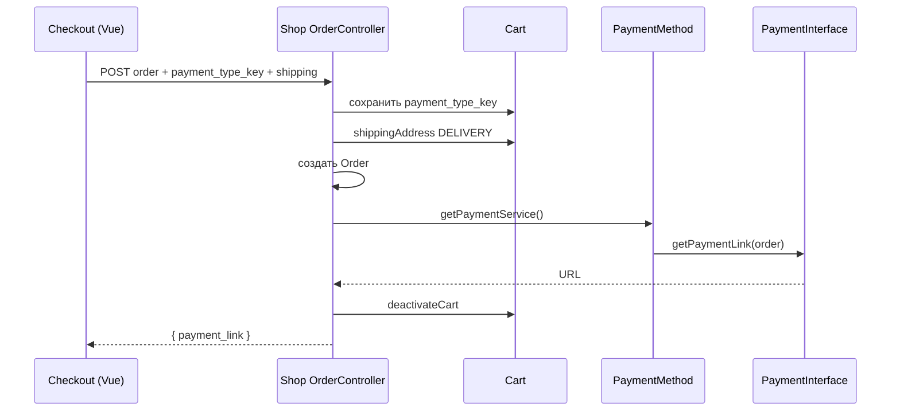

# Система оплаты

## Идея

Способы оплаты хранятся в БД (`payment_methods`). Код способа (`PaymentMethodEnum`) выбирает PHP-компонент, который умеет:

1. выдать ссылку на оплату (`getPaymentLink`);
2. принять server-to-server callback (`callback`);
3. принять редирект покупателя success / cancel.

Контроллер не знает провайдера: он вызывает `$paymentMethod->getPaymentService()`.

## Диаграмма классов



## Классы

| Класс | Путь | Роль |
|-------|------|------|
| `PaymentInterface` | `app/Components/Payments/PaymentInterface.php` | Контракт провайдера |
| `Payment` | `app/Components/Payments/Payment.php` | Базовая реализация: URL callback/success/cancel, редирект на страницу заказа |
| `PaySera` | `app/Components/Payments/PaySera/PaySera.php` | WebToPay + XML payment-methods API |
| `EveryPay` | `app/Components/Payments/EveryPay/EveryPay.php` | Заглушка (ссылки на `/`) |
| `Invoice` | `app/Components/Payments/Invoice/Invoice.php` | Пустое расширение `Payment` |
| `Cash` | `app/Components/Payments/Cash/Cash.php` | Пустое расширение `Payment` |
| `PaymentMethod` | `app/Models/Payment/PaymentMethod.php` | Модель + фабрика сервиса |
| `PaymentMethodEnum` | `app/Enums/Payment/PaymentMethodEnum.php` | Коды способов |
| `PaymentRestriction` | `app/Models/Payment/PaymentRestriction.php` | Модель ограничений «оплата ↔ доставка» (в runtime не используется) |
| `PaymentController` | `app/Http/Controllers/Shop/Api/Payment/PaymentController.php` | Список методов, callback/success/cancel |
| `PayseraPaymentMethodController` | `app/Http/Controllers/Shop/Api/Payment/PayseraPaymentMethodController.php` | Список банков/карт Paysera для чекаута |

## Коды (`PaymentMethodEnum`)

| Case | Value | Компонент | Seeder (типично) |
|------|-------|-----------|------------------|
| `EVERYPAY` | `everypay` | `EveryPay` | неактивен |
| `PAYSERA` | `paysera` | `PaySera` | pre-payment |
| `INVOICE` | `invoice` | `Invoice` | неактивен |
| `PRE_PAY_INVOICE` | `pre_pay_invoice` | `Invoice` | pre-payment |
| `POST_PAY_INVOICE` | `post_pay_invoice` | `Invoice` | post-payment (`user.post_pay`) |
| `CASH` | `cash` | `Cash` | неактивен |

## Фабрика сервиса

```php
// app/Models/Payment/PaymentMethod.php
public function getPaymentService(): PaymentInterface
{
    return match ($this->code) {
        PaymentMethodEnum::EVERYPAY => new EveryPay,
        PaymentMethodEnum::PAYSERA => new PaySera,
        PaymentMethodEnum::INVOICE,
        PaymentMethodEnum::PRE_PAY_INVOICE,
        PaymentMethodEnum::POST_PAY_INVOICE => new Invoice,
        PaymentMethodEnum::CASH => new Cash,
        default => throw new InvalidArgumentException('Invalid payment method'),
    };
}
```

Доступность на чекауте (`scopeAvailablePaymentMethods`):

- магазин: `shop_id` текущего шопа;
- `is_active = true`;
- если у пользователя `post_pay` — `is_active_post_payment`;
- иначе — `is_active_pre_payment`.

Параметр `$shippingMethod` в скоуп передаётся, но **фильтрации по доставке нет**. Модель `PaymentRestriction` в запросах не участвует.

## URL провайдера (базовый `Payment`)

Именованные роуты:

| Метод | Роут | URL |
|-------|------|-----|
| success | `api.payment.success` | `GET /api/payment/{paymentMethod}/success/{order}` |
| cancel | `api.payment.cancel` | `GET /api/payment/{paymentMethod}/cancel/{order}` |
| callback | `api.payment.callback` | `GET /api/payment/{paymentMethod}/callback/{order}` |
| список | `api.payment.get` | `GET /api/payment/{shippingMethod}` |

По умолчанию `getPaymentLink()` ведёт на локализованную страницу заказа `route('order', uuid)`, без внешнего шлюза. PaySera переопределяет это.

## Checkout: создание заказа



Фрагмент:

```php
// app/Http/Controllers/Shop/Api/Order/OrderController.php
if (isset($data['payment_type_key'])) {
    $cart->update(['payment_type_key' => $data['payment_type_key']]);
}

$order->save();

$paymentLink = $cart->paymentMethod->getPaymentService()->getPaymentLink(order: $order);
```

Поле `carts.payment_type_key` — ключ конкретного банка/карты Paysera (`hanza`, `card`, …). Для invoice/cash не обязателен (`StoreOrderRequest`: `nullable|string|max:50`).

Аксессор заказа:

```php
// app/Models/Order/Order.php
public function getPaymentLinkAttribute(): string
{
    return $this->cart->paymentMethod->getPaymentService()->getPaymentLink(order: $this);
}
```

## Callback / success / cancel

```php
// app/Http/Controllers/Shop/Api/Payment/PaymentController.php
public function callback(Request $request, PaymentMethod $paymentMethod, Order $order): Response|string
{
    return $paymentMethod->getPaymentService()->callback(request: $request, order: $order);
}
```

Роуты объявлены как **GET** в `routes/api.php`. CSRF для них не исключён явно (`VerifyCsrfToken::$except` пустой); группа `api` обычно не включает CSRF web-middleware.

Базовый `callback()` возвращает пустой `Response`. Базовые `success()` / `cancel()` редиректят на страницу заказа с локалью `$order->locale`.

## Конфигурация в БД

Колонка `payment_methods.configuration` (JSON). Для Paysera в сидере: `project_id`, `password`. Значения задаются в админке / БД, не через `.env`.

Флаги модели: `is_test_mode`, `is_active`, `is_active_pre_payment`, `is_active_post_payment`.

## Invoice / Cash / EveryPay

- **Invoice / Cash** — наследуют `Payment` без override: после заказа `payment_link` = страница заказа.
- **EveryPay** — все методы возвращают/редиректят на `url('/')`. Боевой интеграции нет.

## API-ответ списка методов

`PaymentMethodResource`: `id`, `code`, `title`, `description` (без `configuration`).
