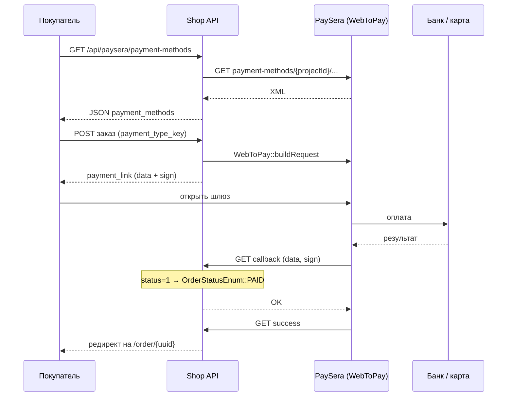

# PaySera

Пакет: `webtopay/libwebtopay`. Класс: `App\Components\Payments\PaySera\PaySera`.

Две независимые интеграции:

1. **Макроплатёж (WebToPay)** — создание платежа и callback.
2. **Payment methods XML API** — список банков/карт для UI чекаута.

## Диаграмма потока оплаты



## Конфигурация

Берётся из `PaymentMethod` с `code = paysera`:

| Ключ | Использование |
|------|----------------|
| `configuration.project_id` | WebToPay `projectid` |
| `configuration.password` | WebToPay `sign_password` |
| `configuration.api.project_id` | XML API (fallback: корневой `project_id`) |
| `configuration.api.base_url` | по умолчанию `https://www.paysera.com` |
| `configuration.settings.default_currency` | по умолчанию `EUR` |
| `is_test_mode` | флаг `test` в `buildRequest` |

```php
$paymentMethod = PaymentMethod::whereCode(PaymentMethodEnum::PAYSERA())->first();
```

## 1. Ссылка на оплату (`getPaymentLink`)

Параметры WebToPay:

| Параметр | Источник |
|----------|----------|
| `projectid` / `sign_password` | configuration |
| `currency` | `CurrencyEnum::EUR()` |
| `country` | `CountryEnum::LV()` (фиксировано, не адрес корзины) |
| `lang` | `LAT` (фиксировано) |
| `orderid` | `$order->prefixed_id` |
| `p_email` / `p_firstname` / `p_lastname` | поля заказа |
| `amount` | `round($order->total_price_with_tax * 100)` — **центы** |
| `test` | `is_test_mode` |
| `accepturl` / `cancelurl` / `callbackurl` | `route('api.payment.*')` |
| `payment` | `$order->cart->payment_type_key`, если задан |

```php
$requestParams = [
    'projectid' => $paymentMethod->configuration['project_id'],
    'sign_password' => $paymentMethod->configuration['password'],
    'currency' => CurrencyEnum::EUR(),
    'country' => CountryEnum::LV(),
    'lang' => 'LAT',
    'orderid' => $order->prefixed_id,
    'p_email' => $order->user_email,
    'amount' => round($order->total_price_with_tax * 100),
    'p_lastname' => $order->user_surname,
    'p_firstname' => $order->user_name,
    'test' => $paymentMethod->is_test_mode,
    'accepturl' => self::getSuccessUrl($paymentMethod, $order),
    'cancelurl' => self::getCancelUrl($paymentMethod, $order),
    'callbackurl' => self::getCallbackUrl($paymentMethod, $order),
];

if ($order->cart->payment_type_key) {
    $requestParams['payment'] = $order->cart->payment_type_key;
}

$response = WebToPay::buildRequest($requestParams);
$order->update(['status' => OrderStatusEnum::PAYMENT_PENDING()]);

return WebToPay::getPaymentUrl().'?data='.$response['data'].'&sign='.$response['sign'];
```

Статус заказа **сразу** становится `PAYMENT_PENDING`, ещё до оплаты.

Подпись: библиотека кодирует параметры в `data` и HMAC в `sign`. Кастомных HTTP-заголовков к шлюзу нет (см. [05-http-header.md](05-http-header.md)).

## 2. Callback (`callback`)

Paysera дергает `GET /api/payment/{paymentMethod}/callback/{order}`.

```php
$response = WebToPay::checkResponse($request->all(), [
    'projectid' => $paymentMethod->configuration['project_id'],
    'sign_password' => $paymentMethod->configuration['password'],
]);

if (isset($response['status']) && $response['status'] == '1') {
    $order->update(['status' => OrderStatusEnum::PAID()]);
    return 'OK';
}

return '';
```

Поведение проверок (важно):

- `test !== '0'`, `type !== 'macro'`, отсутствие `orderid` — только **лог**, выполнение не прерывается.
- Заказ помечается `PAID` при `status == '1'`.
- Исключение: `report()`, ответ пустая строка (Paysera будет ретраить, пока не получит `OK`).
- Логи: канал `payment`.

Сверка суммы с `total_price_with_tax` в коде **не делается**. `orderid` из ответа Paysera с `$order->prefixed_id` **не сверяется** (заказ берётся из URL).

## 3. Success / cancel

`success()` вызывает `WebToPay::checkResponse` и логирует, но **не меняет статус**. Редирект:

```php
LaravelLocalization::getLocalizedURL($locale, route('order', ['uuid' => $order->uuid]));
```

`cancel()` — тот же редирект без проверки подписи.

Статус оплаты должен выставляться **только callback**, не success-редиректом.

## 4. Список способов оплаты (XML API)

Роут: `GET /api/paysera/payment-methods` (`api.paysera.payment-methods`).

Контроллер берёт текущую корзину; если нет суммы — `400`.

```php
$url = "{$baseUrl}/payment-methods/{$projectId}/currency:{$currency}/amount:{cents}/language:{$language}";
$response = Http::timeout(10)->get($url);
$xml = simplexml_load_string($response->body());
```

Пример URL:

```
https://www.paysera.com/payment-methods/{projectId}/currency:EUR/amount:1299/language:lv
```

### Фильтры

- Язык: locale приложения → `lv|en|ru|lt|et`, иначе `lv`.
- Страна: `cart.shippingAddress.country.code`, иначе `lv`.
- Из XML берутся только `<country code="...">` совпадающие со страной доставки.
- Группы: `payment_group` или `group`.
- Суммы `min_amount` / `max_amount` в ответе JSON — в **евро** (деление на 100).

Элемент ответа:

```php
[
    'key' => $key,           // кладётся в payment_type_key / WebToPay payment
    'title' => $title,
    'logo_url' => $logoUrl,
    'min_amount' => $minAmount,
    'max_amount' => $maxAmount,
    'country' => $countryCode,
    'group' => $groupKey,
]
```

Ошибки HTTP/XML → `Log::error` + Exception → контроллер отвечает `500` с общим текстом.

## Связь с чекаутом

1. Фронт грузит `/api/paysera/payment-methods`.
2. Покупатель выбирает `key`.
3. `POST` заказа с `payment_type_key`.
4. `getPaymentLink` передаёт ключ в WebToPay как `payment` — шлюз открывается сразу на выбранный банк/карту.

## Логи

```php
Log::channel('payment')->info(__CLASS__.'::'.__FUNCTION__.'('.__LINE__.'): '.$order->prefixed_id, [
    'Request' => $request->all(),
]);
```

Канал: `config/logging.php` → `laravel-payment.log`.
