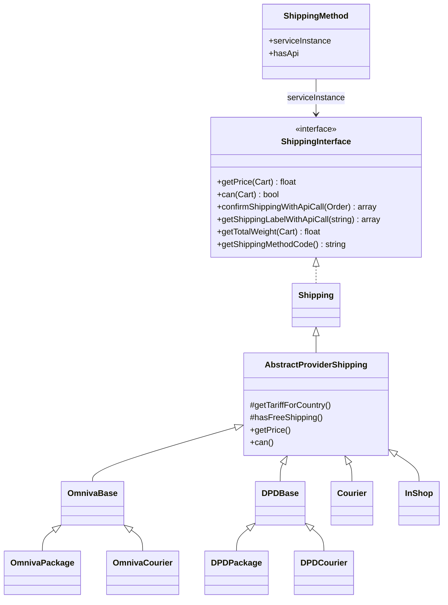
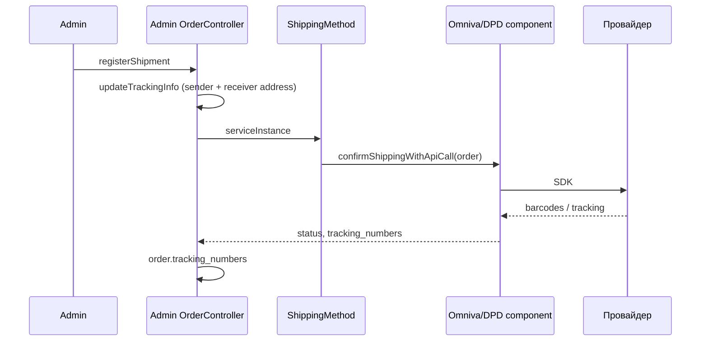

# Система доставки

## Идея

Способы доставки в БД (`shipping_methods`). Код (`ShippingMethodEnum`) выбирает компонент:

- цена и доступность на чекауте (`getPrice`, `can`);
- регистрация отправления в API провайдера (`confirmShippingWithApiCall`);
- PDF-этикетка (`getShippingLabelWithApiCall`).

Тарифы — таблица `shipping_method_tariffs` (страна + диапазон веса + цена). Пункты выдачи — `shipping_pickup_points`.

## Диаграмма классов



## Классы

| Класс | Путь |
|-------|------|
| `ShippingInterface` | `app/Components/Shipping/ShippingInterface.php` |
| `Shipping` | `app/Components/Shipping/Shipping.php` |
| `AbstractProviderShipping` | `app/Components/Shipping/AbstractProviderShipping.php` |
| `OmnivaBase` / `OmnivaPackage` / `OmnivaCourier` | `app/Components/Shipping/Omniva/` |
| `DPDBase` / `DPDPackage` / `DPDCourier` | `app/Components/Shipping/DPD/` |
| `Courier` | `app/Components/Shipping/Courier/Courier.php` |
| `InShop` | `app/Components/Shipping/InShop/InShop.php` |
| `ShippingMethod` | `app/Models/Shipping/ShippingMethod.php` |
| `ShippingMethodTariff` | `app/Models/Shipping/ShippingMethodTariff.php` |
| `ShippingPickupPoints` | `app/Models/Shipping/ShippingPickupPoints.php` |
| `ShippingAddress` | `app/Models/Shipping/ShippingAddress.php` |
| `OmnivaService` | `app/Services/Admin/Api/Shipping/OmnivaService.php` |
| `Shop\ShippingController` | `app/Http/Controllers/Shop/Api/Shipping/ShippingController.php` |
| `Admin\OrderController` | `app/Http/Controllers/Admin/Api/Order/OrderController.php` |

## Коды (`ShippingMethodEnum`)

| Case | Value | Компонент | API провайдера |
|------|-------|-----------|----------------|
| `COURIER` | `courier` | `Courier` | нет |
| `OMNIVA_COURIER` | `omniva_courier` | `OmnivaCourier` | да (`QH`) |
| `OMNIVA_PACKAGE` | `omniva_package` | `OmnivaPackage` | да (`PU`) |
| `DPD_PACKAGE` | `dpd_package` | `DPDPackage` | да |
| `DPD_COURIER` | `dpp_courier` | `DPDCourier` | да |
| `FREE` | `free` | — | нет фабрики (исключение) |
| `IN_SHOP` | `in_shop` | `InShop` | нет |

Значение `DPD_COURIER` в enum — **`dpp_courier`** (так в коде).

`ShippingMethod::hasApi` true только для Omniva и DPD.

## Фабрика

Дублируется в трёх местах (одинаковый `match`):

- `ShippingMethod::getServiceInstanceAttribute`
- `ShippingController::shippingInstance`
- `ShippingMethodWithPriceResource::getShippingInstance`

```php
return match ($this->code) {
    ShippingMethodEnum::OMNIVA_PACKAGE => new OmnivaPackage,
    ShippingMethodEnum::OMNIVA_COURIER => new OmnivaCourier,
    ShippingMethodEnum::DPD_PACKAGE => new DPDPackage,
    ShippingMethodEnum::DPD_COURIER => new DPDCourier,
    ShippingMethodEnum::COURIER => new Courier,
    ShippingMethodEnum::IN_SHOP => new InShop,
    default => throw new InvalidArgumentException('Invalid shipping method'),
};
```

## Цена и доступность

База (`AbstractProviderShipping`):

1. `user.post_pay` → цена `0.00` (кроме логики `can()` у конкретных провайдеров).
2. Иначе тариф: страна адреса корзины (fallback LV) + активный тариф + вес корзины в `[weight_from, weight_to]`.
3. Нет тарифа → `0.00`.
4. `can()` по умолчанию: `getPrice() >= 0` (то есть почти всегда true).

Вес:

```php
$cart->cartItems->sum(fn ($item) => $item->quantity * $item->product->weight);
```

Специальные правила:

| Метод | `can()` | `getPrice()` |
|-------|---------|--------------|
| Omniva * | false, если `user.post_pay` | тариф |
| `Courier` | всегда true | тариф / 0 для post_pay |
| `InShop` | всегда true | всегда `0.00` |

Список на чекауте:

```php
$shop->shippingMethods()
    ->whereIsActive(true)
    ->get()
    ->filter(fn (ShippingMethod $sm) => $this->shippingInstance($sm)->can(cart: $cart));
```

Ресурс отдаёт `price` (строка / «Free») и `numeric_price`.

## Shop API

| Роут | Имя | Назначение |
|------|-----|------------|
| `GET /api/shipping` | `api.shipping.get` | методы с ценой для корзины |
| `GET /api/shipping/{shippingMethod}/pickup-points` | `api.shipping.get.pickup-points` | локеры, фильтр `country_id`, `search`, пагинация |
| `GET /api/shipping/countries` | `api.shipping.get.countries` | все страны |
| `POST /api/shipping/address/{country}` | `api.shipping.address.store` | адрес доставки |

Pickup points: `code` метода + `is_active`. Для select2: `paginate=true`, `per_page`, `page`.

## Регистрация отправления (админка)



Успех: `$order->update(['tracking_numbers' => ...])`.

Этикетки: `getShippingLabelWithApiCall` → attach к заказу (`ShippingMethod::ATTACH_KEY`) → merge PDF через FPDI → download `Content-Type: application/pdf`.

## Карточка товара

`ProductShippingService` проверяет тарифы на временной корзине с одним товаром. Реестры:

- package: `DPDPackage`, `OmnivaPackage`
- courier: `DPDCourier`, `OmnivaCourier`, `Courier`
- in-shop: `InShop`

## Админка тарифов / локеров

- Web: `routes/admin-web.php` — CRUD shipping, pickup points.
- API: `PUT /admin-api/shipping-tariff/{tariff}/courier`.
- Команды: `shipping:sync-omniva` (03:00), `shipping:sync-dpd-lockers` (03:05).

## DPD (кратко)

Отдельная ветка `DPDBase` + стратегии надбавок (energy, customs, labour, island). API — `App\Services\Admin\Api\Shipping\DPDService` / shop `DPDService`. Подробности Omniva — в [04-shipping-omniva.md](04-shipping-omniva.md).
