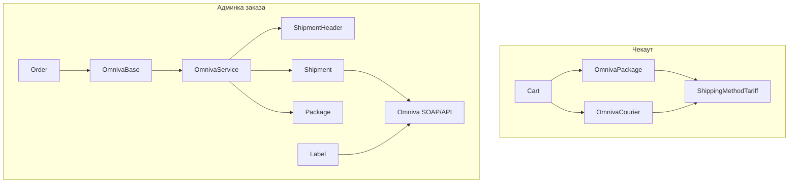

# Omniva

SDK: `mijora/omniva-api`. Обёртка магазина: `App\Services\Admin\Api\Shipping\OmnivaService`.

Компоненты чекаута/админки:

- `OmnivaPackage` — терминал (`omniva_package`)
- `OmnivaCourier` — курьер (`omniva_courier`)

Оба наследуют `OmnivaBase` → `AbstractProviderShipping`.

## Диаграмма



## Конфиг и .env

`config/omniva.php`:

```php
return [
    'username' => env('OMNIVA_USERNAME', ''),
    'password' => env('OMNIVA_PASSWORD', ''),
];
```

Адрес отправителя по умолчанию: `config('order.sender_address')` (`config/order.php`). При регистрации отправления поля отправителя можно переопределить через `order.sender_contact`.

## Коды услуг Omniva

В `OmnivaService`:

```php
const MAIN_SERVICE_PICKUP = 'PU';   // терминал
const MAIN_SERVICE_COURIER = 'QH';  // курьер
```

Выбор в `OmnivaBase::confirmShippingWithApiCall`:

```php
'main_service' => $shipping_method == ShippingMethodEnum::OMNIVA_COURIER()
    ? $this->omnivaService::MAIN_SERVICE_COURIER
    : $this->omnivaService::MAIN_SERVICE_PICKUP,
```

## Цена и доступность

- Тариф как у остальных провайдеров: страна + вес.
- `can()`: **недоступно** для `user.post_pay`.
- Бесплатная доставка через `hasFreeShipping()` для Omniva на чекауте не применяется: post_pay уже отсекается в `can()`.

## Регистрация отправления

`OmnivaBase` собирает массив и вызывает `OmnivaService::createShipping()`.

| Поле | Источник |
|------|----------|
| `main_service` | `QH` / `PU` |
| `full_weight` | `$order->cart->full_weight` |
| `tracking_id` | `OrderHelper::getPrefixedTrackingID($order)` — внутренний ID посылки, не barcode Omniva |
| sender_* | `config('order.sender_address')` или `order.sender_contact` |
| receiver_* | заказ + `cart.shippingAddress` |
| `receiver_identifier` | код терминала (`ShippingPickupPoints.identifier`) |
| `message` | комментарий адреса |

### SDK: объекты отправления

```php
$shipment = new Shipment;

$shipmentHeader = new ShipmentHeader;
$shipmentHeader
    ->setSenderCd(config('omniva.username'))
    ->setFileId(date('Ymdhis'));

$shipment->setShipmentHeader($shipmentHeader);
$shipment->setComment($shippingData['message']);
```

Пакет:

```php
$package = new Package;
$package
    ->setId($shippingData['tracking_id'])
    ->setService($shippingData['main_service']);

if ($shippingData['full_weight'] > 0) {
    $measures = new Measures;
    $measures->setWeight($shippingData['full_weight'] ?: 10);
    $package->setMeasures($measures);
}
```

Адрес отправителя: `Address` (`country`, `postcode`, `deliverypoint` = city+address, `street`).

Адрес получателя:

- **PU (терминал):** `setoffloadPostcode($receiver_identifier)` — ZIP/ID терминала из `locations.json`.
- **QH (курьер):** `setPostcode($receiver_postcode)` — индекс адреса (для LV ожидается формат вроде `LV-1021`).

Контакты: `Contact` (`personName`, `mobile`, `phone`, `email`).

Флаги:

```php
$shipment->setShowReturnCodeSms(false);
$shipment->setShowReturnCodeEmail(false);
$shipment->setAuth(config('omniva.username'), config('omniva.password'));
$result = $shipment->registerShipment();
```

Успех: `$result['barcodes']` → `tracking_numbers` заказа.

Ошибки: `ClientException`, `OmnivaException`, общий `Exception` → `status => error`, лог канал `shipping`.

## Этикетка

```php
$label = new Label;
$label->setAuth(config('omniva.username'), config('omniva.password'));
$tmpFilePath = tempnam(sys_get_temp_dir(), 'pdf');
$label->downloadLabels($tracking_number, false, 'F', $tmpFilePath);
```

`OmnivaBase::getShippingLabelWithApiCall` возвращает:

```php
[
    'status' => 'success',
    'message' => '...',
    'attachment' => [
        'path' => $tmpFilePath.'.pdf',
        'name' => basename($tmpFilePath).'.pdf',
    ],
]
```

Админка прикрепляет файл к заказу и при скачивании склеивает PDF.

## Синхронизация терминалов

Команда: `php artisan shipping:sync-omniva` (в Sail: `./vendor/bin/sail artisan shipping:sync-omniva`).

Расписание: ежедневно `03:00`, `withoutOverlapping`, письмо на `config('mail.schedule_emails')` при ошибке.

Источники:

| Страна | URL |
|--------|-----|
| LV | `https://www.omniva.lv/locations.json` |
| LT | `https://www.omniva.lt/locations.json` |
| EE | `https://www.omniva.ee/locations.json` |

Фильтр точек: `A0_NAME == ISO` и `TYPE == 0` (почтоматы).

Маппинг в `shipping_pickup_points`:

| Колонка | JSON Omniva |
|---------|-------------|
| `code` | `omniva_package` |
| `identifier` | `ZIP` |
| `city` | `A1_NAME` |
| `zip` | `{ISO}-{ZIP}` |
| `address` | `NAME` + `A5_NAME` + `A7_NAME` (если не `'NULL'`) |

Перед вставкой: `forceDelete()` старых точек этой страны с кодом `omniva_package`, затем `QueryHelper::massInsert`.

Курьер Omniva pickup points не синхронизирует — нужен обычный адрес.

## Пример: регистрация терминала

```php
$shipping = new OmnivaPackage;
$result = $shipping->confirmShippingWithApiCall($order);

// $result['status'] === 'success'
// $result['tracking_numbers'] === ['3S…']  // barcode Omniva
```

Для курьера — `new OmnivaCourier` с тем же вызовом; в payload уйдёт `QH` и индекс вместо `offloadPostcode`.
