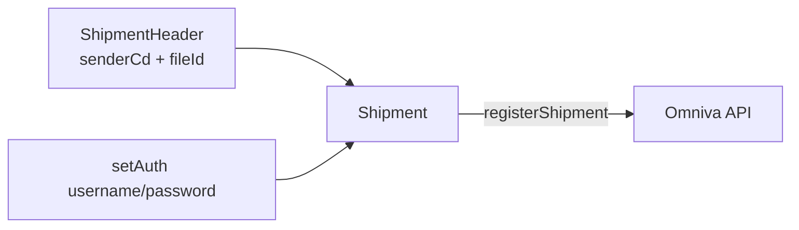

# HTTP header

В проекте «header» встречается в двух смыслах:

1. **HTTP-заголовки** запросов/ответов Laravel и фронтенда.
2. **Omniva `ShipmentHeader`** — заголовок XML/SOAP-документа отправления (не HTTP).

## 1. Omniva `ShipmentHeader`

Класс SDK: `Mijora\Omniva\Shipment\ShipmentHeader`.

Используется **только** в `OmnivaService::createShipping()`.

Назначение: идентификация клиента и файла выгрузки в API Omniva. Без header `Shipment::registerShipment()` невалиден.

```php
use Mijora\Omniva\Shipment\ShipmentHeader;

$shipmentHeader = new ShipmentHeader;
$shipmentHeader
    ->setSenderCd(config('omniva.username')) // код отправителя = логин
    ->setFileId(date('Ymdhis'));             // уникальный id файла YYYYMMDDhhiiss

$shipment->setShipmentHeader($shipmentHeader);
```

| Сеттер | Значение в проекте | Смысл |
|--------|--------------------|--------|
| `setSenderCd` | `config('omniva.username')` | Customer / sender code в Omniva |
| `setFileId` | `date('Ymdhis')` | Идентификатор пакета (коллизии возможны при двух вызовах в одну секунду) |

Auth на HTTP-уровне SDK задаётся отдельно:

```php
$shipment->setAuth(config('omniva.username'), config('omniva.password'));
```

То же для этикеток: `$label->setAuth(...)`.

Диаграмма:



Подробности сборки адреса/пакета: [04-shipping-omniva.md](04-shipping-omniva.md).

## 2. HTTP-заголовки магазина (axios)

`resources/assets/shop/js/app.js`:

```javascript
window.axios.defaults.headers.common['X-Requested-With'] = 'XMLHttpRequest';
window.axios.defaults.headers.common['X-CSRF-TOKEN'] = $('meta[name="csrf-token"]').attr('content');
```

| Заголовок | Зачем |
|-----------|--------|
| `X-Requested-With: XMLHttpRequest` | Laravel распознаёт AJAX |
| `X-CSRF-TOKEN` | токен из `<meta name="csrf-token">` для web-запросов |

Админский бандл задаёт те же axios-defaults.

`VerifyCsrfToken::$except` пустой: исключения URL нет. Callback Paysera идёт на группу `api` (без web CSRF).

## 3. HTTP-заголовки ответов (этикетки)

Скачивание смерженного PDF в `Admin\Api\Order\OrderController`:

```php
$headers = [
    'Content-Type' => 'application/pdf',
];

return response()->download($outputFilePath, 'merged.pdf', $headers)
    ->deleteFileAfterSend(true);
```

## 4. Исходящие вызовы без кастомных header

**Paysera XML payment-methods:**

```php
Http::timeout(10)->get($url);
```

Только timeout; Authorization / API-key в header нет — `projectId` в path.

**Paysera WebToPay:** редирект GET с query `data` и `sign`, не header.

**Omniva locations.json:**

```php
$client = new Client(['base_uri' => $url]);
$client->get('');
```

Публичный JSON, без auth-header.

**Omniva register/label:** заголовки (SOAP, Basic Auth) формирует SDK `mijora/omniva-api` внутри `setAuth` / `registerShipment` / `downloadLabels`. В прикладном коде проекта заголовки не выставляются вручную.

## Сводка

| Слой | Что именно |
|------|------------|
| Omniva документ | `ShipmentHeader` (`senderCd`, `fileId`) |
| Omniva HTTP | Basic Auth через SDK `setAuth` |
| Shop SPA | `X-Requested-With`, `X-CSRF-TOKEN` |
| Admin PDF | `Content-Type: application/pdf` |
| Paysera | query `data`/`sign` и path `projectId`, не HTTP header |
