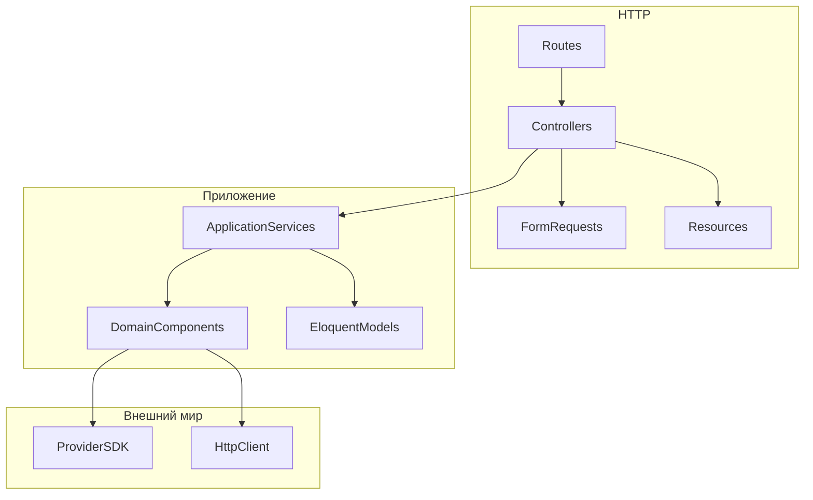

# Принципы целевой архитектуры

## Слои



| Слой | Где живёт | Что умеет | Чего не умеет |
|------|-----------|-----------|----------------|
| Контроллер | `app/Http/Controllers/...` | HTTP in/out, вызов сервиса | бизнес-правила, SDK, `match` по провайдерам |
| Form Request | `app/Http/Requests/...` | валидация входа | запись в БД |
| Application service | `app/Services/...` | оркестрация (заказ + оплата + корзина) | детали Paysera/Omniva |
| Component (стратегия) | `app/Components/Payments` / `Shipping` | контракт одного провайдера | знание о других провайдерах |
| Model | `app/Models/...` | данные, связи, scopes | new `PaySera()`, вызовы HTTP |
| Config | `config/*.php` | секреты и URL через `env()` | `env()` вне config |

Правило Laravel Boost: `env()` только в `config/`. В коде — `config('omniva.username')`.

## Один провайдер — один класс стратегии

Новый банк или перевозчик = новый класс + пункт в **одной** фабрике (или методе enum).  
Запрещено копировать `match (Enum)` в контроллер, Resource и модель одновременно.

**Должно быть:** enum знает класс драйвера, контейнер создаёт экземпляр.

```php
enum PaymentMethodEnum: string
{
    case PAYSERA = 'paysera';

    /**
     * @return class-string<\App\Components\Payments\PaymentInterface>
     */
    public function driver(): string
    {
        return match ($this) {
            self::PAYSERA => \App\Components\Payments\PaySera\PaySera::class,
            // ...
        };
    }
}
```

```php
final class PaymentGatewayFactory
{
    public function make(\App\Models\Payment\PaymentMethod $method): \App\Components\Payments\PaymentInterface
    {
        return app($method->code->driver());
    }
}
```

Модель вызывает фабрику, не `new PaySera`.

## Контракт стабилен, адаптер меняется

Интерфейс `PaymentInterface` / `ShippingInterface` — публичный контракт магазина.  
SDK (`WebToPay`, `Mijora\Omniva`) живёт **только** внутри адаптера (`PaySera`, `OmnivaService`).

Если SDK сменит API — меняется один класс, не `OrderController`.

## Деньги и статусы

- Сумма во внешний шлюз — в **минорных единицах** (центы), явно и округлённо одинаково при создании платежа и при callback.
- Статус заказа меняет **только доверенный callback** (подпись проверена). Success-редирект покупателя статус не ставит.
- Callback **идемпотентен**: повторный `OK` при уже `PAID` — успех, не ошибка.
- Нельзя помечать `PAID`, не сверив `orderid` и сумму.

## Доступность метода = явное «да»

`can(Cart): bool` должен быть `false`, если нет тарифа, страна не обслуживается, вес вне диапазона, пользователь в запрещённой группе.

Антипаттерн: `return $this->getPrice($cart) >= 0` — ноль неотличим от «тарифа нет», метод всегда доступен.

## Ошибки внешнего API

Адаптер ловит SDK-исключения и возвращает **единую форму**:

```php
/**
 * @return array{status: 'success'|'error', message: string, tracking_numbers?: array<int, string>}
 */
```

Контроллер не парсит XML/SOAP. Логи — в канал `payment` / `shipping`, без паролей и полных PAN. PII (телефон, email) — маскировать или не писать в production.

## HTTP vs доменный header

Это разные сущности. Не смешивать в одном разделе кода без комментария:

- HTTP header — транспорт (`Authorization`, `Content-Type`, `X-CSRF-TOKEN`).
- Omniva `ShipmentHeader` — поля **документа отправления** (`senderCd`, `fileId`).

Подробно: [05-http-header.md](05-http-header.md).

## Тесты как зеркало контракта

Feature-тест на callback: подпись, сумма, повторный вызов, чужой `orderid`.  
Feature-тест на `can()`: post_pay, нет тарифа, есть тариф.  
Без теста «для галочки» (`assertTrue(true)`).

## Что не делать «заодно»

- Не тащить DPD-надбавки в Omniva.
- Не класть `project_id` / пароль Paysera в сидер как единственный источник правды — только `.env` / админ-конфиг.
- Не расширять интерфейс методом «на всякий случай». Новый метод — когда есть второй потребитель.
