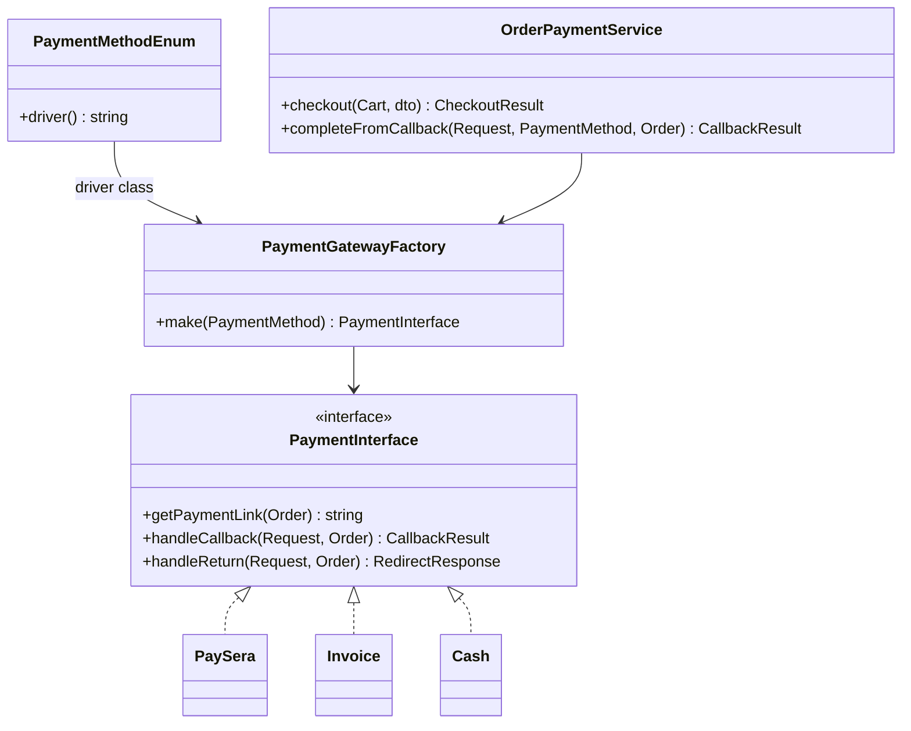

# Платежи — как должно быть

Связанный снимок кода: [../doc/01-payments.md](../doc/01-payments.md).

## Цель модуля

Покупатель выбирает способ оплаты → магазин создаёт заказ → провайдер принимает деньги → магазин **достоверно** узнаёт об этом и ставит `PAID`.

Контроллер магазина не знает, Paysera это или счёт. Он говорит: «дай ссылку» / «обработай callback».

## Целевая диаграмма



`EveryPay` в целевой модели либо полноценный адаптер, либо **не регистрируется** в enum/сидере как активный. Заглушка, которая отдаёт `url('/')`, в продакшен-список методов не попадает.

## Контракт

Интерфейс оставить узким. URL success/cancel/callback — детали базового класса или именованные роуты, не часть публичного API каждого драйвера, если все провайдеры ходят на одни и те же три роута.

Рекомендуемый результат callback — объект, а не «строка или Response»:

```php
final class PaymentCallbackResult
{
    public function __construct(
        public readonly bool $acknowledged,
        public readonly string $body,
        public readonly int $httpStatus = 200,
    ) {}
}
```

Провайдеру Paysera нужно тело `OK` и 200. Другому шлюзу — JSON. Контроллер делает `response($result->body, $result->httpStatus)`.

## Фабрика — одно место

**Должно быть:** `PaymentGatewayFactory` + `PaymentMethodEnum::driver()`.

**Антипаттерн (сейчас):** `PaymentMethod::getPaymentService()` с `new PaySera` внутри модели. Модель начинает зависеть от всех адаптеров. Тесты модели тянут SDK.

```php
// цель: контроллер / application service
$gateway = $this->paymentGatewayFactory->make($paymentMethod);
$link = $gateway->getPaymentLink($order);
```

## Checkout (application service)

Оркестрацию вынести из `Shop\Api\Order\OrderController` в сервис (контроллер остаётся тонким: Request → Service → JsonResponse).

Порядок транзакции:

1. Валидация (Form Request уже есть).
2. Сохранить адрес и `payment_type_key` в корзине.
3. Создать `Order` в `DB::transaction`.
4. Получить `payment_link`.
5. Для **онлайн-шлюза** статус `PAYMENT_PENDING` ставить **в адаптере после успешной сборки ссылки**, не раньше.
6. Деактивировать корзину только если заказ и ссылка созданы.
7. Ответ: `{ payment_link }`.

Для invoice/cash ссылка = страница заказа; статус не `PAYMENT_PENDING`, а ожидающий оплаты по счёту (тот статус, который уже принят в `OrderStatusEnum` для этих сценариев).

## Список методов на чекауте

`scopeAvailablePaymentMethods` должен учитывать:

1. `shop_id`, `is_active`;
2. pre/post payment по `user.post_pay`;
3. **`PaymentRestriction`**: если для пары «доставка + оплата» есть запрет — метод скрыть.

Сейчас `$shippingMethod` в scope передаётся и **игнорируется**. В целевой модели это обязательный фильтр, иначе restriction-таблица бессмысленна.

## Роуты callback

- Имена: `api.payment.callback|success|cancel`.
- Метод HTTP — тот, который шлёт провайдер. Если Paysera шлёт GET — GET. Не выдумывать POST «по REST», если шлюз не умеет.
- Binding: `{paymentMethod}` + `{order}` по id/uuid, согласованному с `orderid` в payload.
- CSRF: callback в `api` middleware, без сессии. Не тащить его в `web`.

Success и cancel — **только редирект на витрину заказа**. Никакой смены статуса.

## Идемпотентность и сверки (обязательный чеклист адаптера)

Перед `PAID`:

| Проверка | Если не прошла |
|----------|----------------|
| Подпись / `checkResponse` | не `OK`, лог, 4xx/пустой body по правилам шлюза |
| `orderid` == `$order->prefixed_id` | отказ |
| Сумма в центах == ожидаемая | отказ |
| `type` macro (для Paysera) | отказ в production |
| `test=1` при `is_test_mode=false` | отказ |
| Заказ уже `PAID` | вернуть `OK`, статус не трогать |

## Логи

Канал `payment`. Писать: `order_prefixed_id`, `payment_code`, исход проверки (`signature_ok`, `amount_mismatch`).  
Не писать: `sign_password`, полный `Request::all()` в production.

## Антипаттерны текущей реализации (для учёбы)

| Сейчас | Должно быть |
|--------|-------------|
| `new PaySera` в модели | фабрика + контейнер |
| EveryPay отдаёт `/` | выключен или реализован |
| Restriction не используется | фильтр по доставке |
| Callback логирует test/type и всё равно может поставить PAID | жёсткий reject |
| Нет сверки суммы и orderid | сверка обязательна |
| Контроллер заказа знает про `payment_type_key` | это деталь Paysera-адаптера / DTO чекаута, сервис прокидывает в корзину |
