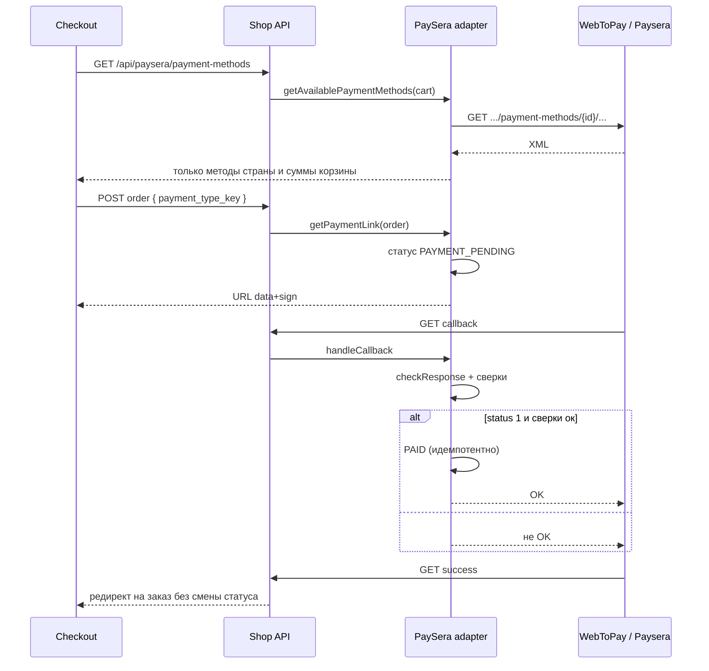

# PaySera — как должно быть

Снимок кода: [../doc/02-payments-paysera.md](../doc/02-payments-paysera.md).  
Общие правила платежей: [01-payments.md](01-payments.md).

Paysera в этом проекте — **два порта** одного адаптера `PaySera`:

1. Макроплатёж (WebToPay) — деньги.
2. XML payment-methods — UI выбора банка/карты.

Оба порта читают одну конфигурацию проекта. Не плодить второй класс «для XML», пока нет второго потребителя XML.

## Конфигурация

Секреты не в сидере.

```php
// config/paysera.php — целевой вид
return [
    'project_id' => env('PAYSERA_PROJECT_ID'),
    'sign_password' => env('PAYSERA_SIGN_PASSWORD'),
    'base_url' => env('PAYSERA_BASE_URL', 'https://www.paysera.com'),
    'default_currency' => 'EUR',
];
```

Админка может **переопределять** значения в `payment_methods.configuration`. Правило чтения:

```
configuration['project_id'] ?? config('paysera.project_id')
```

В адаптере нет захардкоженных `country = LV` и `lang = LAT`, если заказ/корзина уже знают страну и локаль.

| Параметр WebToPay | Целевой источник |
|-------------------|------------------|
| `country` | ISO страны адреса доставки, fallback LV |
| `lang` | карта локали заказа (`lv` → `LAT`, `en` → `ENG`, `ru` → `RUS`) |
| `currency` | валюта магазина / заказа, не константа вслепую, если появится вторая валюта |
| `amount` | одна функция `toMinorUnits(float $amount): int` |
| `orderid` | `$order->prefixed_id` — тот же идентификатор, что сверяем в callback |
| `payment` | `cart.payment_type_key` только если ключ есть в свежем списке методов |
| `test` | `is_test_mode` метода |

## Поток



## Список методов (XML)

Целевой URL тот же path-стиль Paysera:

`{base}/payment-methods/{projectId}/currency:{EUR}/amount:{cents}/language:{locale}`

Правила разбора:

- HTTP timeout + retry политики: 1 повтор на 5xx, без повтора на 4xx.
- Неуспех XML → пустой список **или** ошибка 502 с кодом `paysera_methods_unavailable` — выбрать одно и покрыть тестом. Молчаливый пустой список хуже для отладки, чем явная ошибка чекаута.
- Фильтр страны — обязателен.
- Фильтр `min_amount` / `max_amount` относительно суммы корзины — **на стороне магазина** (XML уже содержит границы; адаптер должен отбросить методы вне суммы).
- `key` сохраняется в `payment_type_key` и позже уходит в WebToPay `payment`.

Контроллер `PayseraPaymentMethodController` остаётся тонким: корзина пустая → 400; дальше только адаптер.

## Callback — эталонная логика

```php
public function callback(Request $request, Order $order): string
{
    $method = $this->getPaymentInstance();

    try {
        $payload = WebToPay::checkResponse($request->all(), [
            'projectid' => $method->configuration['project_id'] ?? config('paysera.project_id'),
            'sign_password' => $method->configuration['password'] ?? config('paysera.sign_password'),
        ]);
    } catch (\Throwable $e) {
        report($e);
        Log::channel('payment')->warning('paysera.callback.invalid_signature', [
            'order' => $order->prefixed_id,
        ]);

        return '';
    }

    if (($payload['test'] ?? '0') !== '0' && ! $method->is_test_mode) {
        Log::channel('payment')->warning('paysera.callback.test_in_live', [
            'order' => $order->prefixed_id,
        ]);

        return '';
    }

    if (($payload['type'] ?? '') !== 'macro') {
        return '';
    }

    if (($payload['orderid'] ?? '') !== $order->prefixed_id) {
        return '';
    }

    $expected = $this->toMinorUnits((float) $order->total_price_with_tax);
    if ((int) $payload['amount'] !== $expected) {
        Log::channel('payment')->warning('paysera.callback.amount_mismatch', [
            'order' => $order->prefixed_id,
            'expected' => $expected,
            'actual' => $payload['amount'] ?? null,
        ]);

        return '';
    }

    if (($payload['status'] ?? '') === '1') {
        if ($order->status !== OrderStatusEnum::PAID) {
            $order->update(['status' => OrderStatusEnum::PAID()]);
        }

        return 'OK';
    }

    return '';
}
```

**Антипаттерн из текущего кода:** проверки `test` / `type` / `orderid` только логируются, заказ всё равно может стать `PAID`. Для учебного стандарта это считается дефектом безопасности, не «особенностью».

Success:

- `checkResponse` можно вызвать для лога;
- редирект на локализованный `route('order', uuid)`;
- **не** ставить `PAID`.

## `payment_type_key`

Поле корзины — транспорт ключа Paysera, не общая платёжная шина «на будущее» без контракта.

Целевые правила:

- валидация: `nullable|string|max:50`;
- если способ оплаты не Paysera — ключ игнорировать или обнулять;
- если Paysera и ключ задан — он должен быть из последнего XML (мягкая проверка: не блокировать checkout, если XML недоступен, но логировать).

## События

После перехода в `PAID` — доменное событие `OrderPaid` (письмо, Horizon, склад). Не слать письма из класса `PaySera`.

## Тесты (минимум)

1. Happy path: валидный payload → `PAID` + тело `OK`.
2. Повтор callback → снова `OK`, один апдейт статуса.
3. Чужой `orderid` → не `PAID`.
4. Неверная сумма → не `PAID`.
5. `test=1` на live-методе → не `PAID`.
6. XML: страна EE, в ответе только EE.
7. Checkout без ключа — ссылка без параметра `payment`; с ключом — параметр есть.
