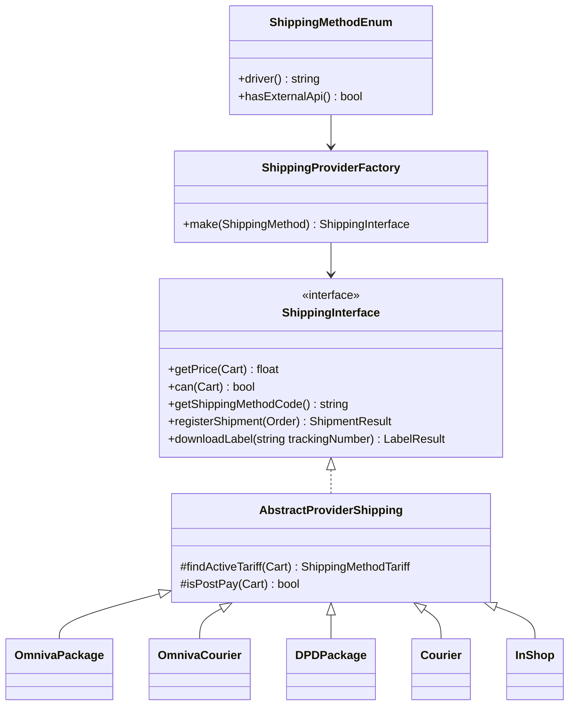

# Доставка — как должно быть

Снимок кода: [../doc/03-shipping.md](../doc/03-shipping.md).

## Цель модуля

На чекауте показать **только применимые** способы с честной ценой.  
В админке зарегистрировать отправление у перевозчика и получить трек + PDF.

Контроллер не собирает SOAP Omniva и не знает коды `PU`/`QH`.

## Целевая диаграмма



## Одна фабрика

Сейчас один и тот же `match` в:

- `ShippingMethod::getServiceInstanceAttribute`
- `ShippingController::shippingInstance`
- `ShippingMethodWithPriceResource::getShippingInstance`

Это учебный пример нарушения DRY и риска рассинхрона (новый enum-case забудут в Resource — цена станет 0, метод «есть»).

**Должно быть:**

```php
enum ShippingMethodEnum: string
{
    case OMNIVA_PACKAGE = 'omniva_package';

    public function driver(): string
    {
        return match ($this) {
            self::OMNIVA_PACKAGE => OmnivaPackage::class,
            // ...
        };
    }

    public function hasExternalApi(): bool
    {
        return match ($this) {
            self::OMNIVA_PACKAGE, self::OMNIVA_COURIER,
            self::DPD_PACKAGE, self::DPD_COURIER => true,
            default => false,
        };
    }
}
```

`FREE` либо имеет драйвер `FreeShipping`, либо **не существует** в БД. Enum-case без драйвера в целевой модели запрещён.

Опечатка `DPD_COURIER = 'dpp_courier'` в стандарте считается дефектом контракта: value должен быть `dpd_courier`. Миграция данных — отдельная задача, не «документированная особенность».

## `can()` и `getPrice()`

```php
public function can(Cart $cart): bool
{
    if ($this->isForbiddenForUser($cart)) {
        return false;
    }

    return $this->findActiveTariff($cart) !== null;
}

public function getPrice(Cart $cart): float
{
    if ($this->hasFreeShipping($cart)) {
        return 0.00;
    }

    return (float) $this->findActiveTariff($cart)?->price;
}
```

Правила:

- Нет тарифа → метод **скрыт** (`can = false`), а не показан как Free.
- `InShop`: `can = true`, цена 0 — это явное исключение, задокументированное в классе.
- Omniva: `post_pay` → `can = false`.
- `Courier` (generic): не «всегда true», а тариф или явное бизнес-правило « couriers always on ». Если правило «всегда» — написать это в PHPDoc и тесте, не молча.

Вес: `quantity * product.weight`. Единица — кг, как ждёт перевозчик. Нулевой вес не должен уходить в API как 0 без политики (минимум 0.001 / дефолт 1 кг — решение фиксируется в адаптере и тесте).

## Результат регистрации

Не свободный `array`. DTO:

```php
final class ShipmentResult
{
    /**
     * @param  array<int, string>  $trackingNumbers
     */
    public function __construct(
        public readonly bool $ok,
        public readonly string $message,
        public readonly array $trackingNumbers = [],
    ) {}
}
```

Админ-контроллер:

```php
$result = $this->shippingProviderFactory
    ->make($order->cart->shippingMethod)
    ->registerShipment($order);

if (! $result->ok) {
    return $this->responseError(data: [], message: $result->message);
}

$order->update(['tracking_numbers' => $result->trackingNumbers]);
```

Адрес отправителя/получателя обновлять **до** вызова адаптера (как сейчас `updateTrackingInfo`) — это application-уровень, не Omniva.

## Этикетка

`downloadLabel(string $trackingNumber): LabelResult` с путём к PDF.  
Контроллер аттачит файл, мержит через FPDI, отдаёт download. Склейка PDF — не ответственность Omniva-адаптера.

## Shop API

| Действие | Правило |
|----------|---------|
| `GET /api/shipping` | только `is_active` + `can(cart)` |
| pickup-points | фильтр `country_id`, активные, код метода |
| страны | не «все Country::get()», а страны, где есть активный тариф выбранных методов (для InShop — только LV, как в админке) |

`GET /api/shipping/countries`, который отдаёт все страны мира, в целевой модели — ошибка продукта. Список стран чекаута = пересечение активных тарифов.

## Карточка товара

`ProductShippingService` с реестрами package/courier/in-shop — допустимый паттерн. Реестр должен строиться из enum/`hasExternalApi` + группы (locker/courier/shop), а не из третьей копии class-list, расходящейся с фабрикой.

## Антипаттерны для разбора на обучении

| Сейчас | Должно быть |
|--------|-------------|
| Три `match` | одна фабрика |
| `can` через `price >= 0` | `can` через наличие тарифа |
| `FREE` без драйвера | case + класс или удаление |
| `dpp_courier` | `dpd_courier` |
| страны чекаута = все страны | страны тарифов |
