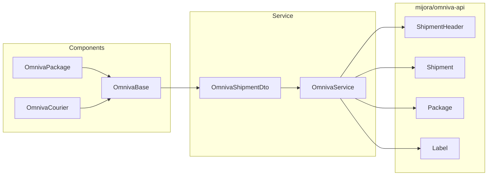

# Omniva — как должно быть

Снимок кода: [../doc/04-shipping-omniva.md](../doc/04-shipping-omniva.md).  
Общая доставка: [03-shipping.md](03-shipping.md).  
Header: [05-http-header.md](05-http-header.md).

Omniva — перевозчик с двумя продуктами в магазине. Общий адаптер API — `OmnivaService`. Компоненты `OmnivaPackage` / `OmnivaCourier` отличаются **кодом услуги и адресом получателя**, не копипастой SOAP.

## Границы классов



| Класс | Ответственность |
|-------|-----------------|
| `OmnivaPackage` / `OmnivaCourier` | `getShippingMethodCode()`, `can()`, маппинг в DTO |
| `OmnivaBase` | сбор DTO из `Order` + `config('order.sender_address')` |
| `OmnivaService` | SDK, auth, header, register, label |
| SDK | XML/SOAP, HTTP |

`OmnivaBase` не должен знать `ShipmentHeader`. `OmnivaService` не должен знать Eloquent `Order`.

## Коды услуг

Константы сервиса — единственное место:

```php
public const SERVICE_PICKUP = 'PU';
public const SERVICE_COURIER = 'QH';
```

| Метод магазина | Услуга | Адрес получателя |
|----------------|--------|------------------|
| `omniva_package` | `PU` | `offloadPostcode` = `identifier` терминала |
| `omniva_courier` | `QH` | почтовый индекс адреса (`LV-1021` для LV) |

Путать PU и QH нельзя: терминал без `offloadPostcode` и курьер с ZIP терминала — разные дефекты, оба должны ловиться валидацией **до** SDK.

## DTO вместо «магического массива»

Сейчас `createShipping(array $shippingData)` с ключами-строками. Цель:

```php
final class OmnivaShipmentDto
{
    public function __construct(
        public readonly string $service,
        public readonly float $weightKg,
        public readonly string $internalPackageId,
        public readonly OmnivaPartyDto $sender,
        public readonly OmnivaPartyDto $receiver,
        public readonly ?string $pickupIdentifier,
        public readonly ?string $comment,
    ) {}
}
```

Для `PU` `pickupIdentifier` required. Для `QH` — `receiver.postcode` required, identifier null.

## ShipmentHeader

Обязателен перед `registerShipment`.

| Поле | Правило |
|------|---------|
| `senderCd` | `config('omniva.username')`, не пустой (иначе не вызывать API) |
| `fileId` | уникальный на регистрацию: `Ulid::generate()` или `prefixed_id + '-' + uniqid()` |

`date('Ymdhis')` — антипаттерн: два заказа в одну секунду могут столкнуться.

Auth: `setAuth(config('omniva.username'), config('omniva.password'))` на `Shipment` и на `Label`. Пароль не логировать.

Подробнее про путаницу с HTTP: [05-http-header.md](05-http-header.md).

## Вес и меры

- Источник: вес корзины в кг.
- Если вес ≤ 0 — либо отказ регистрации («укажите вес»), либо фиксированный минимум, записанный в конфиг `omniva.default_weight_kg`. Сейчас `full_weight ?: 10` при `> 0` ветке легко понять неправильно. Стандарт: явная политика в одном `if`.

## Ответ API

Успех — только непустой `barcodes`. Это **трек-номера Omniva**, их пишем в `order.tracking_numbers`.  
`setId(internalPackageId)` — внутренний id, его нельзя выдавать клиенту как трек.

Ошибки SDK → `ShipmentResult::fail($e->getMessage())` без проброса сырого SOAP в UI, если сообщение длинное/техническое. Полный ответ — в канал `shipping`.

## Этикетка

`downloadLabels($barcode, ...)` во временный файл. Имя файла = barcode. Контроллер аттачит по ключу barcode.

Повторное скачивание: если файл на диске есть — не дергать API. Если файла нет — скачать снова (как сейчас). Это правильный кэш.

## Синхронизация локеров

Команда `shipping:sync-omniva` ежедневно.

Целевые правила:

- Источники JSON по странам LV/LT/EE — ок.
- `TYPE == 0` — зафиксировать в комментарии команды: «почтомат». Если Omniva сменит TYPE, команда сломается осознанно.
- Идентификатор терминала = `ZIP` из JSON — тот же, что уйдёт в `offloadPostcode`.
- Синхронизация **идемпотентна**: лучше upsert по `(code, country_id, identifier)`, чем `forceDelete` + insert (окно, в котором чекаут видит 0 точек).
- Не синхронизировать точки для `omniva_courier`.

## Конфиг

```php
// config/omniva.php
return [
    'username' => env('OMNIVA_USERNAME'),
    'password' => env('OMNIVA_PASSWORD'),
    'default_weight_kg' => 1,
];
```

Пустые credentials в production: `registerShipment` сразу `fail('Omniva is not configured')`, без вызова SDK.

## `can()` / цена

Как у всех тарифных методов + запрет `post_pay`.  
Нет тарифа на страну/вес → метод скрыт.

## Тесты (минимум)

1. Package DTO: есть `pickupIdentifier`, service `PU`.
2. Courier DTO: нет identifier, service `QH`, есть postcode.
3. `can` false для `post_pay`.
4. `can` false без тарифа.
5. `fileId` уникален на два последовательных вызова (мок времени не нужен, если ULID).
6. Пустой barcode → fail, заказ не обновляется.
7. Sync: upsert не уничтожает точки другой страны.
