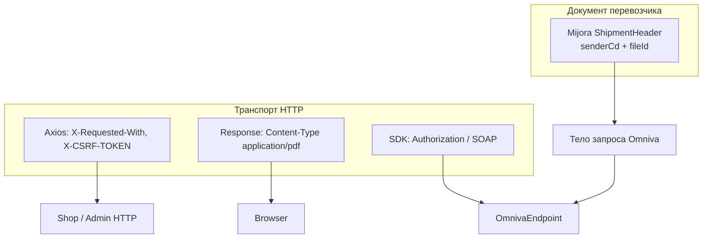

# HTTP header и ShipmentHeader — как должно быть

Снимок кода: [../doc/05-http-header.md](../doc/05-http-header.md).

Это **две разные абстракции**. В учебном стандарте их нельзя называть одним словом «header» без уточнения.



## 1. Доменный header: Omniva `ShipmentHeader`

Это **не** HTTP. Это обязательный узел XML/SOAP отправления.

Контракт магазина к SDK:

```php
$header = new ShipmentHeader;
$header
    ->setSenderCd(config('omniva.username'))
    ->setFileId($uniqueFileId);

$shipment->setShipmentHeader($header);
```

Правила:

| Правило | Почему |
|---------|--------|
| Header задаётся в `OmnivaService`, не в контроллере | контроллер не знает SDK |
| `fileId` уникален на попытку регистрации | повтор и параллель |
| Пустой `senderCd` → fail до HTTP | не слать пустой SOAP |
| Не логировать header вместе с password | секрет рядом в `setAuth` |

`setAuth` — это уже **транспортная** аутентификация SDK. Её не дублировать самодельным `Http::withHeaders(['Authorization' => ...])`, пока используется официальный клиент.

## 2. HTTP-заголовки витрины

Целевой набор для JSON API магазина (axios):

| Заголовок | Когда |
|-----------|--------|
| `Accept: application/json` | все API-вызовы SPA |
| `X-Requested-With: XMLHttpRequest` | как сейчас |
| `X-CSRF-TOKEN` | только запросы, которые идут через `web` + сессию |
| `Authorization: Bearer ...` | если endpoint под Sanctum |

Не слать CSRF на чистый `api` middleware, если сессии там нет — токен будет мёртвым грузом.

Callback Paysera **не должен** требовать CSRF и cookie покупателя: это server-to-server.

## 3. HTTP-заголовки ответов админки

Скачивание этикетки:

```php
return response()->download($path, $filename, [
    'Content-Type' => 'application/pdf',
    'Content-Disposition' => 'attachment; filename="'.$filename.'"',
]);
```

`download()` уже ставит Content-Disposition; дублировать не обязательно. Важно: не отдавать PDF с `Content-Type: text/html` при ошибке — ошибки API остаются JSON (`responseError`).

## 4. Исходящие HTTP-клиенты

Целевой стандарт для всех вызовов наружу (Paysera XML, Omniva JSON локеров, при необходимости DPD):

| Параметр | Стандарт |
|----------|----------|
| Timeout | явный (`->timeout(10)`), не бесконечный |
| Retry | только идемпотентный GET, ограниченно |
| Headers | `Accept` по формату (`application/xml`, `application/json`) |
| Auth | из `config()`, не из сидера |
| Лог | URL без query-секретов, status, время; не тело с PII |

Пример целевого вызова Paysera:

```php
Http::timeout(10)
    ->accept('application/xml')
    ->get($url);
```

Пример локеров Omniva:

```php
Http::timeout(30)
    ->acceptJson()
    ->get('https://www.omniva.lv/locations.json');
```

Guzzle `Client(['base_uri' => $fullUrl])` + `get('')` работает, но в стандарте предпочтителен Laravel `Http` фасад — единообразие, проще mock в тестах (`Http::fake()`).

## 5. Что нельзя смешивать в голове и в коде

| Фраза | Правильный объект |
|-------|-------------------|
| «Поставить header Omniva» | `ShipmentHeader` |
| «Поставить Authorization» | HTTP / SDK `setAuth` |
| «CSRF header» | axios `X-CSRF-TOKEN` |
| «PDF header» | `Content-Type` ответа Laravel |
| «Подпись Paysera» | query `data` + `sign`, не HTTP header |

Paysera WebToPay **намеренно** без кастомных HTTP-заголовков: целостность в `sign`. Не добавлять `X-Api-Key` «для красоты» — шлюз его не ждёт.

## Чеклист ревью

- [ ] В `OmnivaService` есть `ShipmentHeader` с уникальным `fileId`.
- [ ] Пароль Omniva не в логах и не в git.
- [ ] Callback оплаты без CSRF.
- [ ] SPA шлёт CSRF только туда, где он проверяется.
- [ ] Исходящие HTTP имеют timeout.
- [ ] В документации и комментариях «header» уточнён: HTTP или ShipmentHeader.
